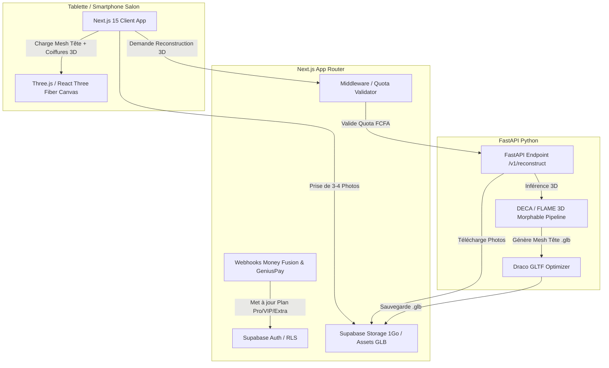

# Afrofade - Technical Architecture Spine

## 1. Paradigm & Core Principles
- **Paradigm**: Hybrid Monolith-API with Dedicated ML Microservice (Next.js 15 App Router + FastAPI 3D Processing Microservice).
- **Core Principles**:
  1. **Zero-Latency 3D Rendering**: Heavy 3D reconstruction is offloaded to FastAPI asynchronously; 3D visualization and real-time hairstyle swapping happen on the client device via React Three Fiber (R3F) & Three.js with WebGL acceleration.
  2. **Strict Quota & Data Isolation**: Database-level Row Level Security (RLS) and middleware checks enforce subscription tiers (Pro, VIP, Extra) and monthly generation quotas.
  3. **African Payment First**: Native webhooks for Money Fusion and GeniusPay for seamless Mobile Money subscription renewal (Wave, Orange Money, MTN, Moov).

---

## 2. System Context & Architecture Diagram

---

## 3. Architectural Decisions (ADs)

### AD-1: Frontend & 3D Interactive Canvas
- **Status**: [ADOPTED]
- **Binds**: Next.js 15 (React 19), TypeScript, Tailwind CSS, React Three Fiber (R3F), Three.js, `@react-three/drei`.
- **Prevents**: Laggy canvas renders, heavy initial JS bundles, incompatible custom 3D web engines.
- **Rule**: All 3D meshes (head reconstruct + hair/beard assets) MUST be compressed using Draco/Meshopt `.glb` format. Initial model loading must stay under 2 MB.

### AD-2: 3D AI Reconstruction Microservice
- **Status**: [ADOPTED]
- **Binds**: FastAPI (Python 3.11+), PyTorch, DECA (Detailed Expression Capture and Animation) / FLAME 3D Morphable Model pipeline.
- **Prevents**: Slow NeRF/Gaussian Splatting multi-gigabyte generation times; inability to isolate facial morphometry from hairstyle meshes.
- **Rule**: FastAPI receives 3-4 multi-angle image URLs, performs landmark alignment, fits the 3D head mesh, and exports a standardized `.glb` head mesh with uv texture within 2 seconds.

### AD-3: Persistence, Auth & Cloud Storage
- **Status**: [ADOPTED]
- **Binds**: PostgreSQL + Supabase (Auth, Row Level Security, Supabase S3 Storage).
- **Prevents**: Unauthorized access across salons; quota bypass; unmanaged storage growth.
- **Rule**: Every database query MUST pass through RLS matching `salon_id = auth.uid()`. Storage bucket for VIP/Extra client cards is capped at 1 GB per salon.

### AD-4: Mobile Money Payment Gateway Strategy
- **Status**: [ADOPTED]
- **Binds**: Money Fusion API + GeniusPay SDK/Webhooks.
- **Prevents**: Cart abandonment due to lack of credit card options; manual subscription approvals.
- **Rule**: Subscriptions automatically renew via webhook listener `/api/webhooks/payment`. Quota counters reset on the 1st of each billing cycle upon successful payment confirmation.

### AD-5: Data Schema (Core Tables)
- **Status**: [ADOPTED]
- **Binds**:
  - `salons`: `id`, `name`, `phone`, `plan` (PRO, VIP, EXTRA), `quota_limit`, `quota_used`, `storage_used_bytes`.
  - `subscriptions`: `id`, `salon_id`, `provider` (money_fusion, genius_pay), `amount_fcfa`, `status`, `expires_at`.
  - `clients_heads`: `id`, `salon_id`, `client_name`, `photos_urls` (JSONB), `mesh_3d_url`, `saved_hairstyle_id`, `is_saved_permanently`.
  - `hairstyles_catalog`: `id`, `category` (fade, locks, tresses, afro, barbe), `title`, `thumbnail_url`, `mesh_3d_url`, `is_premium_upsell`.
- **Prevents**: Inconsistent field naming; orphan records when a salon deletes a client entry.

### AD-6: Inter-Service Communication Security
- **Status**: [ADOPTED]
- **Binds**: HTTPS REST APIs with Shared JWT Bearer Token secret between Next.js and FastAPI.
- **Prevents**: Public access to the FastAPI ML worker; server memory overload during image uploads.
- **Rule**: Clients upload raw images directly to Supabase Storage via presigned URLs. Next.js passes only the image URLs to FastAPI.

---

## 4. Deferred Decisions
- **Offline Support (PWA Caching)**: Caching 3D assets locally for offline salon use will be evaluated post-MVP.
- **AI Hair Texture Generation (Stable Diffusion Inpainting Integration)**: Custom texture generation from prompt deferred to V2.
