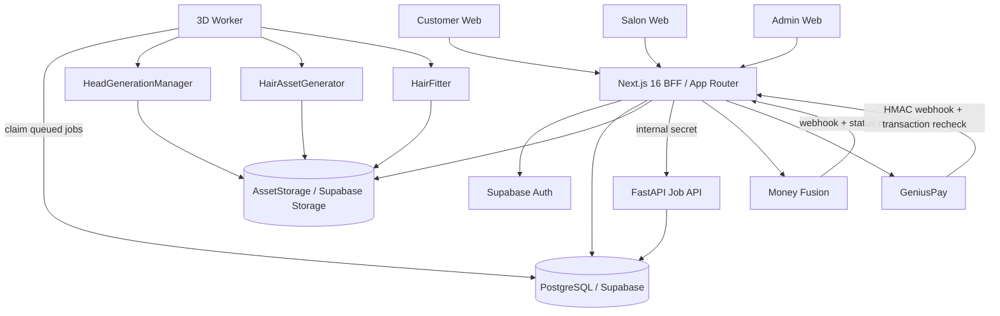

# Afrofade — Technical Architecture Spine (Post-P0)

Date: 2026-08-19
Status: PROPOSED / BMAD Correct Course
Supersedes: `_bmad-output/architecture/architecture-Afrofade-2026-08-17/ARCHITECTURE-SPINE.md`

## 1. Architecture Paradigm

Afrofade est un **modular web application + dedicated asynchronous 3D service** :

- Next.js 16 / React 19 : UI, BFF, auth/session, commerce, tenant authorization ;
- Supabase/PostgreSQL : identité métier, RLS, commerce, jobs, métadonnées ;
- Supabase Storage via abstraction `AssetStorage` : photos temporaires et assets 3D durables ;
- FastAPI/Python : reconstruction/fitting/normalisation 3D ;
- worker Python séparé : exécution des jobs persistants ;
- React Three Fiber/Three.js : viewer et composition interactive client-side.

Le design doit maintenir une séparation stricte entre :

1. génération de tête ;
2. génération/catalogage des coiffures ;
3. fitting/essayage ;
4. rendu interactif.

---

## 2. System Context



---

## 3. Architectural Invariants

### INV-1 — Server-authoritative identity

Une identité métier n'est jamais dérivée de localStorage, d'un domaine e-mail ou de la simple présence d'un cookie.

- Supabase valide le token ;
- `user_profiles` détermine `customer | salon | admin` ;
- le serveur dérive `salon_id` ;
- l'admin est autorisé côté serveur.

### INV-2 — Server-authoritative commerce

- le client envoie des IDs de produit, pas le prix faisant foi ;
- toute transaction est persistée `pending` avant appel provider ;
- le retour navigateur n'est pas preuve de paiement ;
- Money Fusion est revalidé via son endpoint de statut ;
- GeniusPay exige HMAC + relecture transaction ;
- `finalize_afrofade_payment` est atomique/idempotent ;
- subscriptions/wallets sont dérivés de la DB.

### INV-3 — Generate hair once, reuse many

Les providers coûteux de génération coiffure sont des outils de fabrication du catalogue, pas une dépendance du try-on utilisateur.

### INV-4 — Durable jobs

Aucun job important ne dépend uniquement d'un dictionnaire Python en mémoire. Tous les jobs 3D ont un état persistant.

### INV-5 — Durable assets

Aucun asset productif n'est servi depuis `/tmp` ou un chemin développeur. Tout output durable est publié dans `AssetStorage` et référencé par metadata DB.

### INV-6 — Provider-neutral domain contracts

Les consommateurs manipulent `CanonicalHead`, `CanonicalHairAsset` et `TryOnAsset`, jamais les formats spécifiques TRELLIS/Hunyuan/FLAME directement.

---

## 4. Runtime Stack

### Web

- Next.js 16.3.1 ;
- React 19.2 ;
- TypeScript ;
- Tailwind ;
- React Three Fiber 9.7 ;
- Drei 10.7 ;
- Node 22 CI/runtime-compatible.

### 3D Service

- Python 3.11 ;
- FastAPI ;
- PyTorch ;
- OpenCV ;
- MediaPipe ;
- Trimesh/Scipy ;
- providers 3D encapsulés derrière interfaces.

### Data

- PostgreSQL/Supabase ;
- Supabase Auth ;
- RLS ;
- Supabase Storage initialement, encapsulé par une interface S3-like.

---

## 5. Core Domain Contracts

### 5.1 CanonicalHead

```ts
interface CanonicalHead {
  id: string;
  ownerType: 'customer' | 'salon_client';
  ownerId: string;
  sourceJobId: string;
  provider: string;
  meshUrl: string;
  previewUrl?: string;
  coordinateSystem: 'Y_UP_RIGHT_HANDED';
  unit: 'meter';
  scalpAnchorVersion: string;
  scalpAnchorsUrl?: string;
  vertexCount?: number;
  polygonCount?: number;
  textureUrls?: string[];
  createdAt: string;
}
```

Minimum invariant : axes/unités documentés, mesh durable, provenance provider/job et version d'anchors.

### 5.2 CanonicalHairAsset

```ts
interface CanonicalHairAsset {
  id: string;
  styleId: string;
  version: number;
  provider: 'trellis2' | 'hunyuan_multiview' | 'manual';
  meshUrl: string;
  previewUrl: string;
  coordinateSystem: 'Y_UP_RIGHT_HANDED';
  unit: 'meter';
  scalpAnchorVersion: string;
  anchorMapUrl: string;
  polygonCount: number;
  lods?: string[];
  generationCostFcfa?: number;
  status: 'draft' | 'validated' | 'published' | 'retired';
}
```

### 5.3 TryOnAsset

```ts
interface TryOnAsset {
  id: string;
  headId: string;
  hairAssetId: string;
  fitJobId?: string;
  transform: {
    position: [number, number, number];
    rotation: [number, number, number];
    scale: [number, number, number];
  };
  fittedMeshUrl?: string;
  createdAt: string;
}
```

Le try-on peut d'abord utiliser transforms/anchors temps réel ; un fitted mesh durable est optionnel selon le cas d'export.

---

## 6. Persistent Job Architecture

### AD-7 — PostgreSQL-backed Job Queue for P1

**Status: ADOPTED for P1**

Pour la première version durable, utiliser PostgreSQL/Supabase comme source de vérité des jobs plutôt qu'introduire Redis immédiatement.

Table cible `ai_jobs` :

- `id UUID` ;
- `job_type` (`head_reconstruction`, `hair_generation`, `hair_normalization`, `hair_fit`) ;
- `user_id` nullable ;
- `salon_id` nullable ;
- `status` (`queued`, `running`, `completed`, `failed`, `cancelled`) ;
- `provider` ;
- `input JSONB` ;
- `output JSONB` ;
- `error_code`, `error_message` ;
- `attempts`, `max_attempts` ;
- `locked_at`, `locked_by` ;
- `created_at`, `started_at`, `completed_at`, `updated_at`.

Worker :

- claim atomique via transaction + `FOR UPDATE SKIP LOCKED` ;
- lease/heartbeat ;
- retry borné ;
- job idempotency key pour éviter les doublons ;
- restart-safe.

**Why** : déjà Postgres/Supabase dans la stack, faible complexité opérationnelle, suffisant pour le volume initial. Redis/Celery/RQ pourra être introduit derrière une interface `JobQueue` si les métriques montrent une saturation.

---

## 7. Asset Storage Architecture

### AD-8 — AssetStorage abstraction over Supabase Storage

**Status: ADOPTED**

Interface minimale :

- `putObject(path, bytes|stream, contentType)` ;
- `deleteObject(path)` ;
- `createSignedUpload(path, constraints)` ;
- `createSignedRead(path, ttl)` ;
- `exists(path)` ;
- `metadata(path)`.

Buckets/logical prefixes :

- `client-photos/temporary/...` ;
- `heads/canonical/...` ;
- `hair-assets/raw/...` ;
- `hair-assets/canonical/...` ;
- `tryons/exports/...`.

La DB stocke les métadonnées et références ; le filesystem du conteneur n'est pas une API de distribution.

---

## 8. Head Generation Architecture

### AD-9 — HeadGenerationManager

**Status: ADOPTED**

```text
HeadGenerationManager
  -> FlamePyTorchProvider (current)
  -> HunyuanHeadProvider (future)
  -> CanonicalHeadNormalizer
  -> AssetStorage
  -> head_assets metadata
```

Le provider FLAME actuel doit être corrigé/branché sur l'implémentation réellement présente (`ReconstructionPipelineService`) et ne doit pas dépendre d'un import/classe obsolète.

---

## 9. Hair Asset Factory

### AD-10 — HairAssetGenerator

**Status: ADOPTED**

```text
Admin input
  -> HairAssetGenerator
      -> Trellis2HairProvider + Afrofade LoRA
      -> HunyuanMultiViewHairProvider
      -> ManualHairProvider
  -> HairAssetNormalizer
  -> CanonicalHairAsset
  -> AssetStorage
  -> hairstyles_catalog / hair_asset_versions
```

Les providers scaffoldés doivent être implémentés progressivement. Leur coût estimé dans le code n'est pas la source de vérité business tant qu'il n'est pas mesuré/configuré.

---

## 10. Hair Fitting / Try-On

### AD-11 — Separate HairFitter

**Status: ADOPTED**

Le fitting est une capacité distincte :

```text
CanonicalHead + CanonicalHairAsset
           -> HairFitter
           -> transform/anchors
           -> optional fitted mesh/export
```

Objectif UX : changement entre assets disponibles < 500 ms côté viewer après chargement/cache. Les opérations lourdes de reconstruction ne doivent pas être dans cette boucle.

---

## 11. Data Model Additions

Tables/collections cibles P1/P2 :

### `ai_jobs`
Queue persistante et état worker.

### `head_assets`
Référence un `CanonicalHead`, owner, job, provider, mesh, anchors, metrics.

### `hair_asset_versions`
Versionne les assets du catalogue, source provider, raw/canonical URLs, anchors, polycount, statut publication, coût observé.

### `try_on_exports`
Exports HD/durables liés à une tête, un hair asset et éventuellement une transaction de crédit.

Les tables commerce P0 (`payment_transactions`, `credit_wallets`, `credit_transactions`, `credit_purchases`) restent canoniques.

---

## 12. Security Boundaries

- navigateur -> Next.js : session Supabase vérifiée ;
- Next.js -> FastAPI : `API_INTERNAL_SECRET` ;
- navigateur ne peut pas appeler les providers 3D externes directement avec secrets ;
- provider payment -> webhook : mécanisme provider-specific + authoritative recheck ;
- service role Supabase : server-only ;
- signed upload path dérivé de l'identité vérifiée ;
- admin actions : RBAC serveur.

---

## 13. Reliability & Observability

Chaque job expose :

- `job_id` ;
- type/provider ;
- status ;
- attempts ;
- timestamps ;
- duration ;
- structured error ;
- output asset IDs/URLs ;
- provider cost si connu.

Chaque paiement expose :

- internal payment ID ;
- provider/reference ;
- amount expected/verified ;
- lifecycle ;
- idempotent finalization result.

---

## 14. CI/CD Invariants

Avant merge :

- `npm ci` ;
- production dependency audit high severity ;
- `tsc --noEmit` ;
- Next production build ;
- Python constrained dependency install ;
- Python compile ;
- security/commerce invariants ;
- Docker production compose build ;
- containers startup ;
- runtime smoke tests.

Les stories P1 ajouteront tests job lifecycle/storage.

---

## 15. Deferred Architecture Decisions

- Redis/Celery/RQ/ARQ uniquement si les métriques justifient de remplacer/compléter la queue Postgres ;
- CDN dédié pour assets 3D après mesure de trafic ;
- provider Hunyuan Head ;
- stratégie LOD/mesh simplification avancée ;
- pipeline GPU séparé lorsque nécessaire ;
- PWA offline avancée.

---

## 16. P1 Implementation Order

1. migration `ai_jobs`, `head_assets`, `hair_asset_versions`, `try_on_exports` ;
2. interfaces `JobQueue` + `AssetStorage` ;
3. worker Postgres restart-safe ;
4. brancher `HeadGenerationManager` -> FLAME réel ;
5. remplacer outputs `/tmp` par AssetStorage ;
6. produire/persister `CanonicalHead` ;
7. tests lifecycle jobs + ownership + restart/retry ;
8. ensuite implémenter les providers HairAssetGenerator réels.
