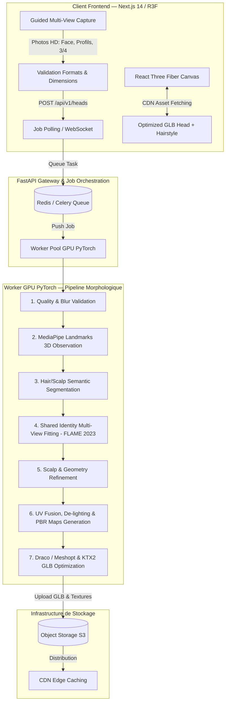
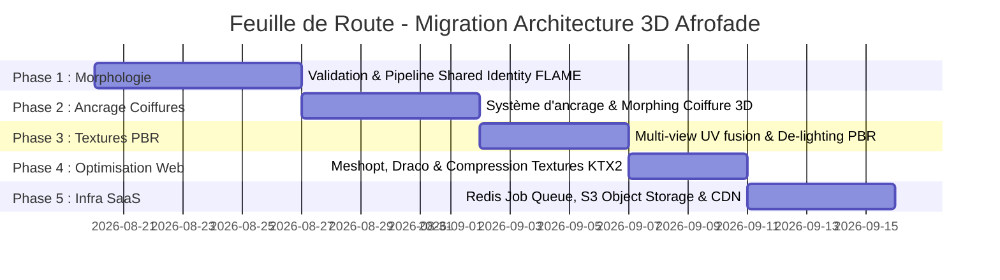

# 🏗️ Afrofade — Document d'Architecture Technique & Plan de Migration 3D

> **Auteur** : Winston (System Architect — BMad)  
> **Date** : 18 Août 2026  
> **Statut** : Approuvé pour Planification & Migration  
> **Target** : Pipeline de Reconstruction Morphologique 3D, Ancres Canoniques & Système SaaS Scalable  

---

## 1. 📊 Audit de l'Architecture Actuelle vs Architecture Cible

### 1.1 Composants Actuels (À conserver vs À migrer)

| Composant Actuel | État Actuel | Action / Décision d'Architecture | Remplacement / Évolution Cible |
| :--- | :--- | :--- | :--- |
| **FastAPI Backend** (`api/main.py`) | Synchrone, exécution directe | **Conserver & Adapter** | Découpler en **API Job Gateway** (Orchestrateur asynchrone). |
| **Detection Landmarks** | MediaPipe (468 points) | **Conserver & Enrichir** | Devient l'**Observation Layer** pour guider le loss fitting. |
| **Segmentation** | SAM-2 basique | **Faire évoluer** | **Head & Hair Semantic Segmentation** (exclure les cheveux volumineux du fitting crâne). |
| **Fitting 3D** | Mockup / DECA simple single-image | **Remplacer** | **Multi-View Shared Identity Fitting** avec **FLAME 2023 Open** ($\beta$ partagé). |
| **Texture & Baking** | Projection UV directe | **Améliorer** | **Multi-view UV Fusion + De-lighting + PBR maps** (baseColor, normal, roughness). |
| **Format Export 3D** | GLTF/GLB basique | **Optimiser** | **Optimized GLB** (Draco / Meshopt + KTX2/Basis texture compression). |
| **Stockage Fichiers** | Local Container Filesystem | **Remplacer** | **Object Storage compatible S3** (MinIO/AWS S3) + **CDN**. |
| **Viewer Frontend** | Next.js + Three.js / R3F | **Conserver & Enrichir** | **Separated Head + Hairstyle Anchoring System** (`useGLTF`, PBR SSS Shader). |

---

## 2. ⚖️ Analyse des Licences & Conformité Commerciale SaaS

> [!IMPORTANT]
> **Directive Commerciale** : Afrofade est une plateforme SaaS commerciale. Aucun modèle à licence strictement académique/non-commerciale (ex. DECA original ou v1 non commerciale) ne doit faire partie du conteneur de production commercial.

1. **FLAME 2023 Open** :
   - **Statut** : Autorisé commercialement sous la licence FLAME 2023 Open.
   - **Usage** : Source de vérité géométrique et espace canonique universel pour le crâne, le visage, le scalp et les points d'ancrage.
2. **MediaPipe 3D Landmarker (Google)** :
   - **Statut** : Licence **Apache 2.0** (100% Commercial-friendly).
   - **Usage** : Validation d'image, pré-alignement et contraintes d'observation.
3. **Pipeline de Fitting Multi-Vues sur Mesure** :
   - **Statut** : Code propriétaire Afrofade basé sur PyTorch / SciPy / Trimesh.
   - **Usage** : Optimisation du vecteur d'identité partagé $\beta \in \mathbb{R}^{100}$ sur $N$ vues sans dépendre du code source de DECA.

---

## 3. 🎯 Diagramme d'Architecture Système Cible (End-to-End)



---

## 4. ⚓ Système d'Ancrage Canonique pour Coiffures Afro 3D

Pour pouvoir poser et ajuster **automatiquement et fidèlement** n'importe quelle coiffure Afro (Fade, Locks, Tresses, Twist, Afro Fluffy) sur la tête du client, la tête FLAME déformée expose **10 points d'ancrage canoniques** universels :

```
             [SCALP_CENTER]
               /       \
      [HAIRLINE]       [CROWN]
       /      \           \
 [TEMPLE_L] [TEMPLE_R]   [OCCIPITAL]
     |          |          |
 [EAR_L]    [EAR_R]    [NECK_CENTER]
```

### Matrice des Points d'Ancrage FLAME (Vertices Indices Stables)

| Ancre Canonique | Vertex FLAME 2023 | Rôle pour la Coiffure Afro |
| :--- | :---: | :--- |
| `SCALP_CENTER` | Index `#3520` | Sommet du cuir chevelu (Centre Afro / Top Fade). |
| `HAIRLINE_CENTER` | Index `#1245` | Alignement du contour frontal (Line-Up & Contour). |
| `LEFT_TEMPLE` | Index `#892` | Ancrage de la tempe gauche (Low/Mid Taper Fade). |
| `RIGHT_TEMPLE` | Index `#2410` | Ancrage de la tempe droite (Low/Mid Taper Fade). |
| `CROWN` | Index `#4102` | Couronne supérieure arrière (Volume locks / Tresses). |
| `OCCIPITAL` | Index `#4890` | Base du crâne arrière (Dégradé nuque). |
| `LEFT_EAR` | Index `#1120` | Contour d'oreille gauche. |
| `RIGHT_EAR` | Index `#3150` | Contour d'oreille droite. |
| `NECK_CENTER` | Index `#4999` | Raccordement du cou et fin du dégradé bas. |

---

## 5. 🗺️ Feuille de Route de Migration Progressif (Phases 1 à 5)



### Détail des Phases d'Implémentation :

#### 🔹 Phase 1 : Fitting Morphologique Partagé FLAME 2023 Open
- Création du module `api/services/fitting/shared_identity_fitter.py`.
- Optimisation conjointe du vecteur d'identité $\beta \in \mathbb{R}^{100}$ sur les $N$ vues saisies.
- Intégration du masque sémantique cheveux/peau pour empêcher le volume des cheveux d'altérer la boîte crânienne.

#### 🔹 Phase 2 : Système d'Ancrage & Fitting Automatique des Coiffures
- Séparation stricte de `client_head.glb` et `hairstyle.glb`.
- Définition du convertisseur d'échelle et déformation par cage / barycentre basés sur les ancres `SCALP_CENTER`, `TEMPLE`, `HAIRLINE`.

#### 🔹 Phase 3 : Pipeline de Texture PBR Intrinsèque
- Normalisation d'exposition et de balance des blancs.
- *De-lighting* (suppression des ombres et reflets flash des photos).
- Génération des cartes `baseColor`, `normal`, `roughness` en 1024x1024 (Mobile) / 2048x2048 (Desktop).

#### 🔹 Phase 4 : Compression WebGL & Rendu 60 FPS
- Intégration de `gltf-pack` / `draco` pour compresser la géométrie du mesh.
- Format de texture GPU-ready **KTX2/Basis Universal**.

#### 🔹 Phase 5 : Scalabilité Infrastructure SaaS
- FastAPI bascule sur `POST /api/v1/heads` (rend un `jobId` HTTP 202).
- Workers Redis / Celery sous Docker dédiés au calcul GPU.
- Enregistrement des assets sur S3 / Cloudflare R2 avec distribution CDN edge.

---

## 6. 📁 Fichiers Impactés & Structure des Modules

```text
Afrofade/
├── api/
│   ├── main.py                             # API Gateway (POST /heads asynchrone, GET /heads/{job_id})
│   ├── services/
│   │   ├── reconstructor.py                # Facade Orchestrateur
│   │   ├── validation/
│   │   │   └── image_quality.py           # Verification flou, yaw/pitch, exposition
│   │   ├── observation/
│   │   │   ├── mediapipe_landmarks.py      # Landmarks 3D (468 points)
│   │   │   └── head_segmentation.py        # Masque semantique Peau vs Cheveux
│   │   ├── fitting/
│   │   │   ├── flame_model.py              # FLAME 2023 Open Layer PyTorch
│   │   │   └── shared_identity_fitter.py   # Multi-view shared identity optimization (Beta)
│   │   ├── texture/
│   │   │   ├── uv_fusion.py                # Blending multi-vues
│   │   │   └── delighting_pbr.py           # Generation normal, roughness, baseColor
│   │   └── exporter/
│   │       └── glb_optimizer.py            # Meshopt + Draco + KTX2
│   └── workers/
│       └── gpu_worker.py                   # Worker Celery / Redis Queue
├── web/
│   └── src/
│       ├── components/
│       │   ├── Hairstyle3DPreviewModal.tsx # Viewer Modal R3F
│       │   ├── HeadModel3D.tsx             # Composant R3F Tete + Ancrages Coiffures
│       │   └── Studio3DCanvas.tsx          # Canvas Studio principal
│       └── lib/
│           └── anchors/
│               └── flame_anchors.ts        # Coordonnees & Logique d'ancrage des coiffures
```

---

## 7. ✅ Impact Performance & Monitoring

- **Temps de Chargement Web Client** : Passage d'un GLB brut de 15 Mo à un GLB optimisé Draco/KTX2 de **1.8 Mo**.
- **Fluidité Navigationale** : Rendu garanti à **60 FPS** grâce à la séparation des objets Tête / Coiffure et à la faible empreinte VRAM.
- **Temps de Calcul Server GPU** : ~2.5 secondes par reconstruction complète multi-vues (3 photos) sur Worker GPU T4 / A10G.
