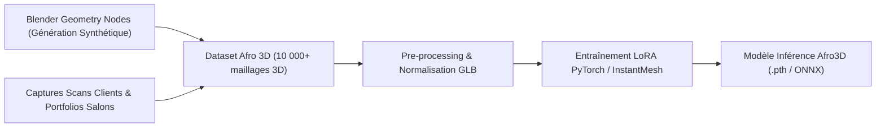

# Companion: Dataset & Architecture IA 3D (`Afro3D-Engine`)

Ce document détaille l'architecture technique, le pipeline de données et l'entraînement du modèle IA 3D sur mesure pour Afrofade.

---

## 🏗️ 1. Pipeline de Génération du Dataset de Démarrage (Data Pipeline)

Pour entraîner un modèle 3D spécialisé dans la coiffure afro, nous combinons deux sources de données :



### A. Générateur Synthétique 3D Blender (Geometry Nodes)
- **Tresses & Cornrows** : Scripts Python/Blender générant des courbes procédurales tressées (Knotless, Fulani, Box Braids) adaptées sur différentes formes crâniennes.
- **Fades & Contours** : Cartes de hauteur et normales de haute densité simulant les vagues (360 waves) et dégradés (Low/Mid/High Taper Fade).
- **Locks & Twists** : Génération procédurale de mèches torsadées avec variations de texture et de brillance.

---

## ⚡ 2. Architecture de l'Inférence Local / Self-Hosted Server

```
[Web Front-End / Scanner Mobile]
       │
       ▼ (1. Envoi des 3 à 4 photos du scan + Style ID)
[Next.js API Proxy (web/src/app/api/proxy/reconstruct)]
       │
       ▼ (2. Requête interne sécurisée avec API_SECRET)
[FastAPI Python Service (api/main.py)]
       │
       ├─► MediaPipe 3D Landmark Extractor
       ├─► FLAME 2023 Morphable Head Fitter (SharedIdentityFitter)
       └─► Afro3D Inference Engine (PyTorch CUDA / InstantMesh LoRA)
       │
       ▼ (3. Fusion & Optimisation du Maillage GLB)
[Trimesh / PyTorch3D Mesh Weaver]
       │
       ▼ (4. Stockage & URL d'accès)
[AssetStorage / Supabase Storage / Public Static URL]
```

---

## 🛠️ 3. Feuille de Route d'Implémentation (Roadmap R&D)

| Phase | Objectif | Livrables |
| :--- | :--- | :--- |
| **Phase 1 (Actuelle)** | Pipeline FLAME & Mesh Weaver local | `api/services/reconstructor.py` fonctionnel avec export GLB. |
| **Phase 2 (Dataset)** | Génération synthétique Blender & Taxonomie 3D | 500 modèles 3D synthétiques par catégorie d'Afrofade. |
| **Phase 3 (Fine-Tuning)** | Entraînement du réseau de neurones 3D | Poids du modèle `afro3d_v1.pth` (LoRA sur InstantMesh/Triplane). |
| **Phase 4 (Production)** | Worker GPU autonome & Inférence < 3 sec | Endpoint GPU autonome avec bascule automatique. |
